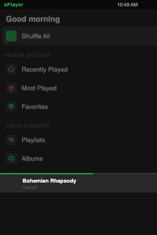
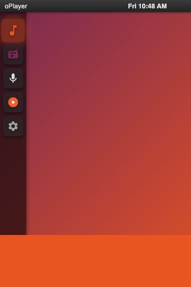
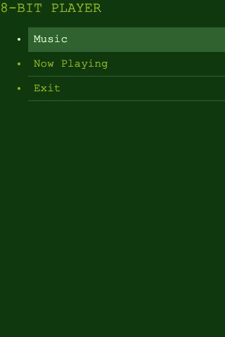

# oPlayer Custom Themes

Welcome to the official community theme repository for **oPlayer**. This repository hosts experimental, community-driven themes that you can download and install directly into your app to customize your listening experience.

> **Disclaimer:** External themes are experimental and considered third-party content. Please install them at your own risk.

---

## How to Install a Theme

Installing a custom theme in oPlayer is quick and easy:

1. **Download a Theme:** Browse the [Available Themes](#-available-themes) below and download the `.zip` file to your Android device. *(Do not unzip the file).*
2. **Open oPlayer Settings:** Navigate to **Settings** > **Themes**.
3. **Enable External Themes:** Ensure the "Enable External Visual Themes" toggle is turned **On**.
4. **Import:** Tap **+ Import New Theme** and select the `.zip` file you just downloaded.
5. **Apply:** Once imported, select your new theme from the **Installed User Themes** list to apply it instantly!

---

## Available Themes

### Spotify Green (v1.0.0)
A modern dark theme inspired by Spotify's iconic design. Features a green-on-dark palette, categorized home screen with Quick Access and Library sections, 4x4 album grid with artwork, mini-player bar with animated EQ indicator, Now Playing view with animated gradient background, lyrics support (long-press), search, equalizer presets, and sleep timer.



**Features:**
- Time-based greeting (Good morning / afternoon / evening)
- Shuffle All, Recently Played, Most Played, Favorites
- Full library browsing: Playlists, Albums, Artists, Genres, Folders
- Podcasts and Radio support
- Search across songs, albums, artists, and podcasts
- Now Playing with progress bar, shuffle/repeat indicators
- Lyrics view (long-press on Now Playing)
- Settings: Equalizer, Sleep Timer, Theme switching
- Mini-player with animated EQ bars while music plays
- Volume OSD overlay

* **Download:** [`spotifyTheme.zip`](https://raw.githubusercontent.com/sghmire/oplayer-themes/main/builds/spotifyTheme/spotifyTheme.zip)

---

### Ubuntu Theme (v1.0.4)
Clean, Linux-inspired desktop styling featuring classic Ubuntu orange and dark aubergine accents. Features a dock-based launcher, Nautilus-style file explorer windows with 4x4 grid views for albums and folders, list views with context-aware icons, Rhythmbox-style Now Playing, and a full settings panel with EQ presets and sleep timer.



**Features:**
- Ubuntu desktop with dock, top bar, and draggable windows
- Music explorer with Folders, Albums, and All Songs views
- 4x4 grid with album art, folder icons, and podcast art
- List views with music/radio/podcast icons per context
- Radio stations and Podcast browsing with episode drill-down
- Rhythmbox-style Now Playing with album art and progress
- Settings: Shuffle, Repeat, EQ, Sleep Timer, Themes, Library Refresh
- Volume OSD overlay

* **Download:** [`ubuntuTheme.zip`](https://raw.githubusercontent.com/sghmire/oplayer-themes/main/builds/ubuntuTheme/ubuntuTheme.zip)

---

### 8-Bit Theme (v1.0.0)
Retro styled theme with an old-school 8-bit pixel aesthetic from the olden days. Simple menu-driven interface for browsing and playing music.



* **Download:** [`8bitTheme.zip`](https://raw.githubusercontent.com/sghmire/oplayer-themes/main/builds/8bitTheme/8bitTheme.zip)

---

## Build Your Own

Want to design your own custom skin for oPlayer? Because the UI is built entirely with web technologies, you have complete freedom to reshape the player however you want using standard HTML, CSS, and JavaScript.

Check out the official **[Theme Development Guide](THEME_DEVELOPMENT.md)** for full API documentation, boilerplate code, and testing instructions.

Once your theme is ready, you can submit a Pull Request following our contribution guidelines to get it listed in this community repository!

---

## Repository Structure (For Maintainers)

Only the **latest version** of each theme is kept in the repository. Git history and tags are used for versioning.

```text
oplayer-themes/
├── builds/
│   ├── 8bitTheme/
│   │   ├── src/                   <-- Source code
│   │   └── 8bitTheme.zip          <-- Distributable
│   ├── ubuntuTheme/
│   │   ├── src/                   <-- Source code
│   │   └── ubuntuTheme.zip        <-- Distributable
│   └── spotifyTheme/
│       ├── src/                   <-- Source code
│       └── spotifyTheme.zip       <-- Distributable
├── screenshots/                   <-- Theme preview images
├── preview/                       <-- Browser preview helpers (dev only)
├── index.json                     <-- Master registry for the app
├── THEME_DEVELOPMENT.md           <-- API docs for creators
└── README.md
```
